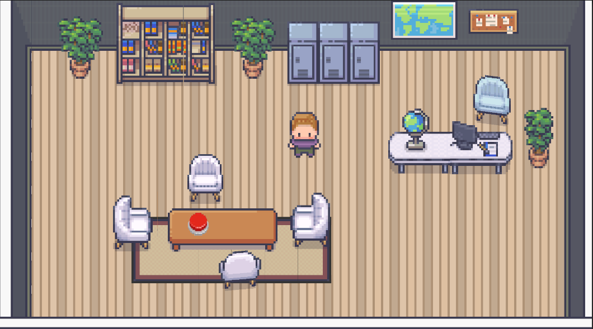
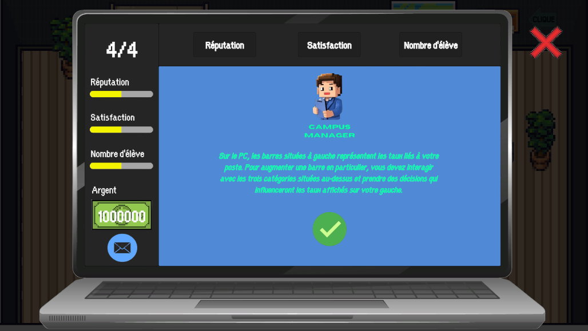
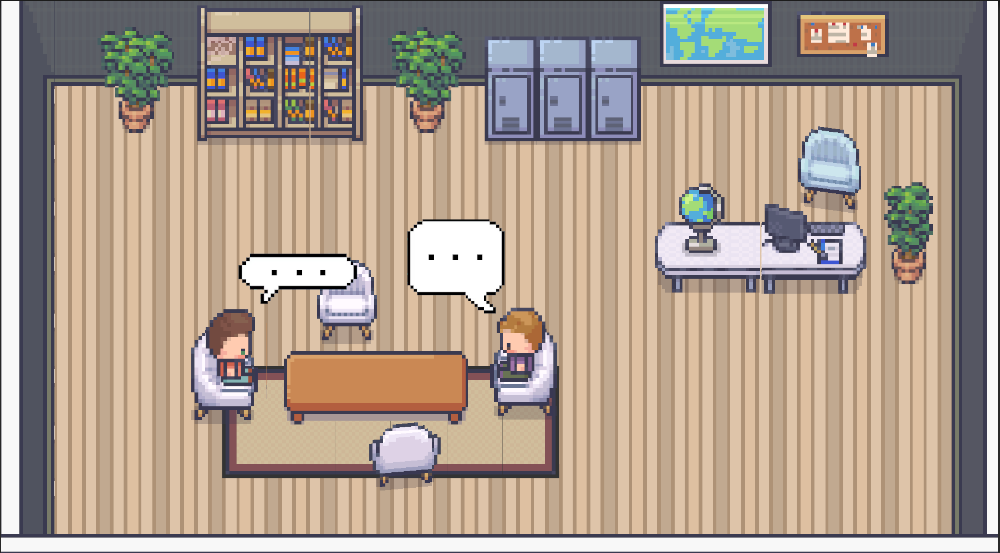

# Description du jeu - Campus Manager

# Objectifs pédagogiques

L’objectif principal de Campus Manager est d'explorer les difficultés liées à la gestion des ressources humaines et de la vice-présidence dans une université. Le joueur doit prendre des décisions stratégiques pour gérer efficacement l’IUT, en surmontant des défis comme :

- La gestion des conflits internes entre les employés et les départements.
- La répartition des ressources limitées entre les différents secteurs.
- La prise en charge des crises financières ou sociales qui impactent l'organisation.
- Le recrutement et la gestion du personnel pour répondre aux besoins de l’université tout en respectant le budget disponible.

Le jeu permet au joueur de comprendre les complexités liées à ces aspects.

# Description générale

Campus Manager est un jeu vidéo de simulation dans lequel les joueurs incarnent un Vice-Président Ressources Humaines d'un IUT.
Le jeu propose une expérience immersive où le joueur prend des décisions stratégiques pour gérer les secteurs clés d’un établissement universitaire.
Grâce à des mécaniques de gestion et à des événements dynamiques, le jeu offre un défi stimulant pour ceux qui souhaitent améliorer leurs compétences en gestion et en résolution de problèmes.

## Caractéristiques principales :
- Genre : Simulation, Gestion
- Mode de jeu : Solo
- Plateformes supportées : PC

# Gameplay

## Mécaniques de jeu :
- Prendre des décisions stratégiques : Le joueur choisit parmi plusieurs options pour résoudre des problèmes liés aux secteurs de l’IUT.
- Gestion des ressources : Le joueur doit être capable de gérer les ressources disponibles, telles que le budget en argent et les points d’action.
- Réagir aux crises : Le joueur est confronté à des événements aléatoires qu’il doit gérer en prenant des décisions immédiates.

# Informations que le jeu renvoie au joueur

Le jeu fournit plusieurs types d'informations pour aider le joueur à comprendre l'impact de ses actions et prendre des décisions éclairées :

- Jauge : Chaque section est représenté par une jauge qui montre l'état de sa gestion (Argent, nombre d'élève, satisfaction et réputation). Ces jauges changent en fonction des choix du joueur, permettant de visualiser rapidement l'impact de ses décisions.
- Événements aléatoires : Le joueur peut avoir des évènements spéciaux sous forme de mail où il est mit dans une situation très délicate.

# Visuels

# Développement

## Technologies utilisées

- Unity 2D : Utilisé pour développer le jeu et créer des interfaces interactives.
- Git : Employé comme système de gestion de versions pour le suivi des modifications du code et la collaboration entre les membres de l'équipe.

## Equipe :
- BENOMAR Amine TP1
- FAIVRE Paulin TP5
- KIGMOU Bilal TP2
- SAMI Matthias TP1
